# APNA SHOP

APNA SHOP is a sample application that demonstrates an E-commerce website using the html css & Js stack. 
<!-- The application loads 
products a MongoDB database and displays them. Users can select to display products in a single category. Users can 
click on any product to get more information including pricing, reviews and rating. Users can select items and 
add them to their shopping cart -->

<!-- ## Import Data
I have included a data folder in this repo. Inside that folder will be 2 folders called cart and item. These 2 folders contain a mongodump of the 2 collections that I use in this ecommerce demo. You can use the [import-data.sh](data/import-data.sh) script to import these 2 dumps to an ecommerce database, then you will have the same content that I have for this demo. -->

## Live Demonstration

The APNA SHOP demo can be [view live demo](https://apna-shop.netlify.app/).

Here are screenshots that show the E-commerce demo application in use.

**Home Page Banner**
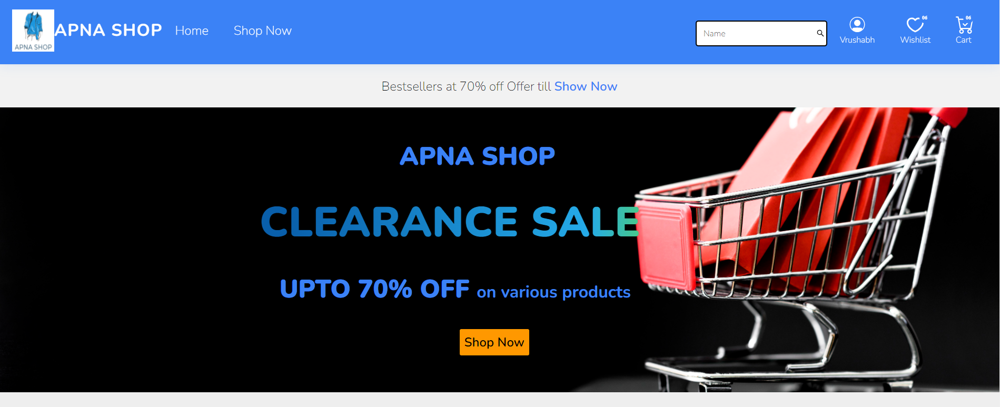

---

**Home Featured Categories**
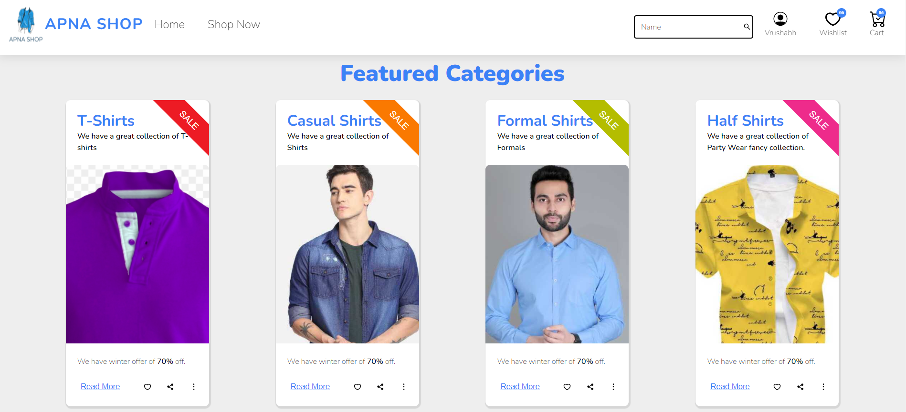

---

**Home Featured Brands**
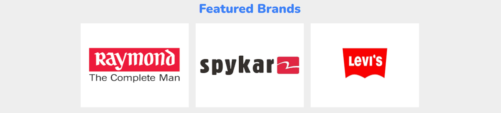

---

**Home Testimonials**
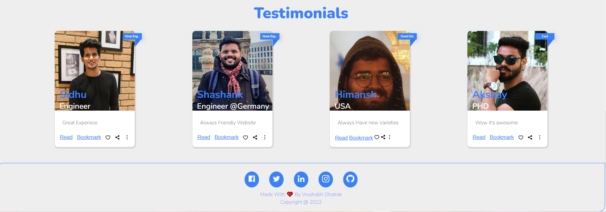

---

**User Profile Page**
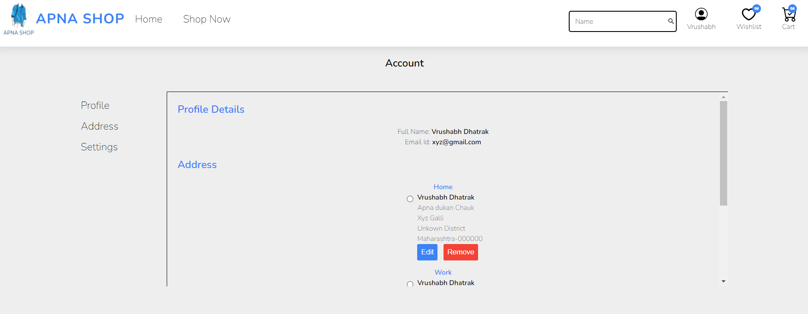

---

**Wishlist Page**
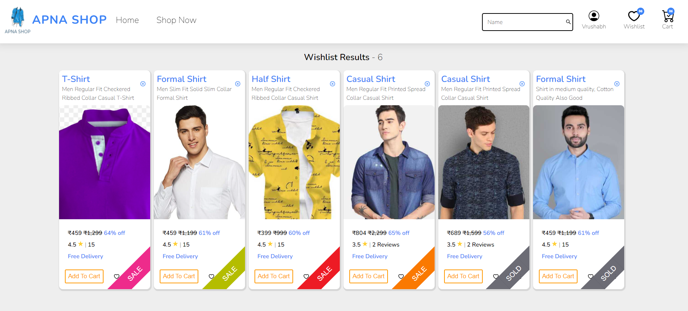

---

**Shopping Cart Page**
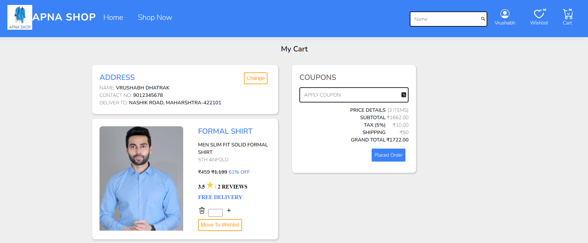

---

**Filter Page**
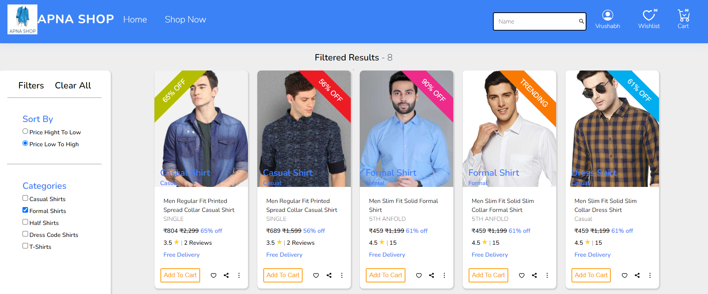

---

**Login Page**
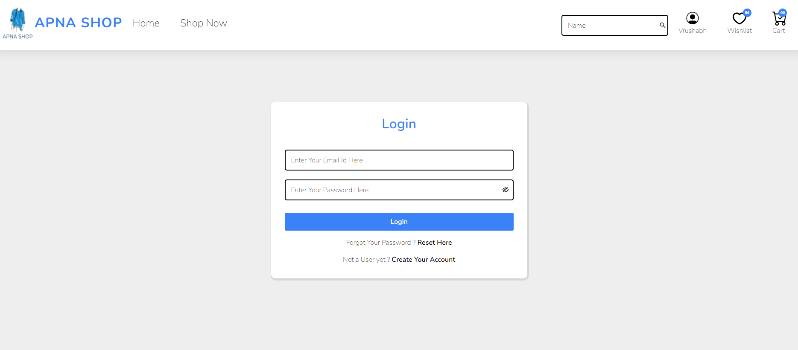

---

**Signup Page**
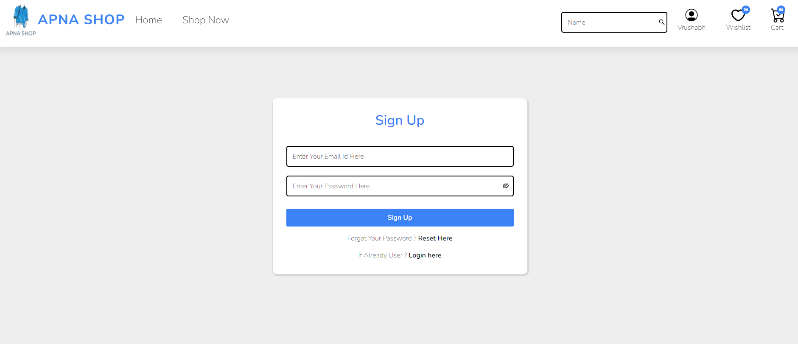

---

**Change Password Page**
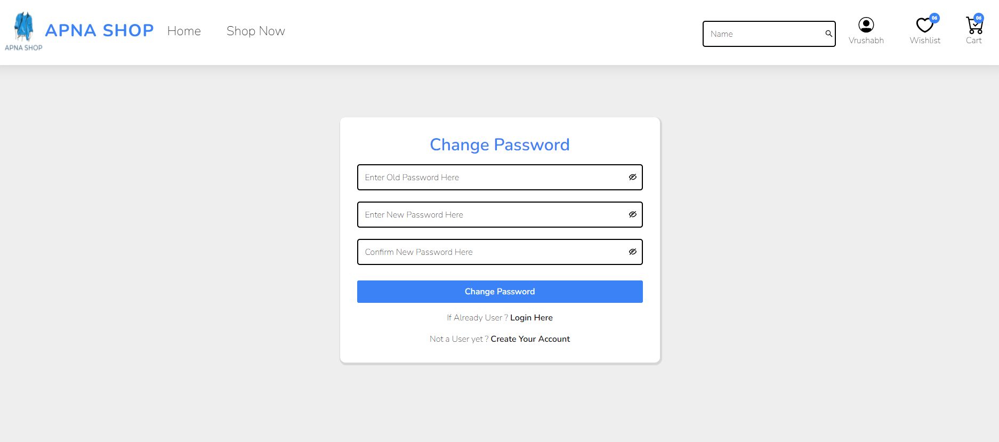

---

## Getting Started
To get started  you can simply clone this `apna-shop` repository and install the dependencies.

Clone the `apna-shop` repository using git:

```bash
git clone https://github.com/Rishi05051997/apna-shop
cd apna-shop
```

Install dependencies with this command:
```bash
npm install
```

Run the application with this command:
```bash
npm start
```

## Tech Stack
* HTML
* CSS
* JS

***Glad to see you here! Show some love by [starring](https://github.com/Rishi05051997/apna-shop) this repo.***

[](https://www.instagram.com/rishidhatrak.dev/) [](https://www.linkedin.com/in/vrushabh-dhatrak/) 